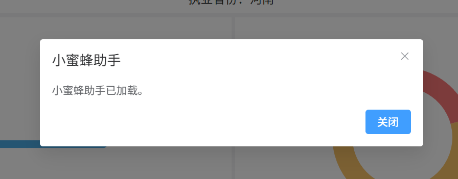
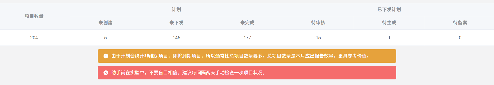
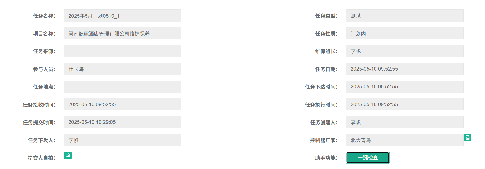
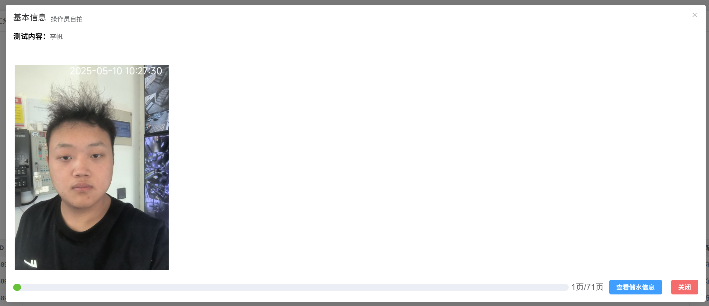
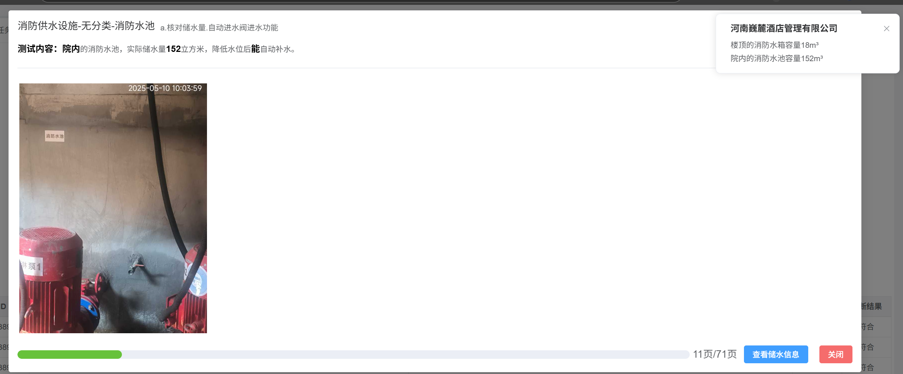

### 小蜜蜂助手

#### 首页

1. 欢迎弹窗

在首页加载时，弹出欢迎窗口，提示用户脚本已加载。

2. 首页看板

在首页加载完成后，在最下方添加数据看板，可以总览一些信息。例如项目总数、未创建计划的项目、未完成的项目计划、待审核的任务、审核通过待生成报告的任务、待备案的任务...

#### 审核任务

在点进任务详情后，会加载任务的所有数据，当用户点击一键检查按钮后，会进行一个弹窗将数据展示出来。

当用户点击检查储水信息的按钮后，会查看项目的所有建筑，将登记的储水信息进行展示。

> [!WARNING]
> 警告，此功能可能不安全。

当任务需要修改，现场操作人员在等待的时候，联系项目负责人再退回是一件很麻烦的事情，很有可能项目负责人正在忙，好半天才联系上。考虑到任务生成报告的时候，只会生成项目负责人通过审核时候的自拍照，所以我们可以直接在网页上进行退回。

所以添加了一个一键退回的按钮，当点击后会自动退回项目。

### 